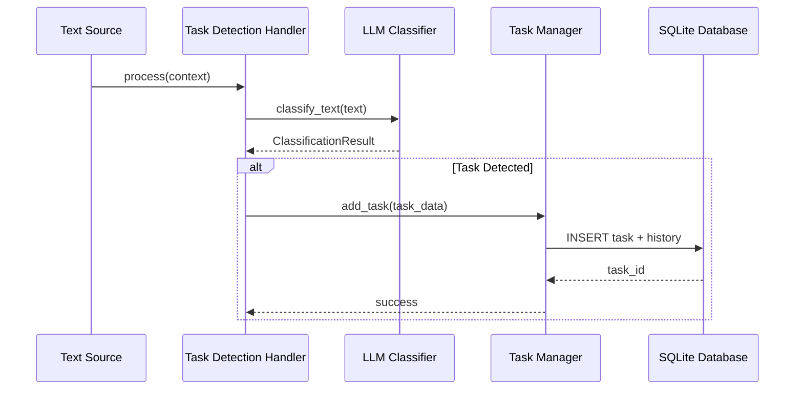

# Design Document: Voice Task Management System

## Overview

Privacy-focused task detection and management using local LLM (Ollama) for classification, SQLite for storage, and MCP for external tool integration.

### Key Principles

1. **Privacy-First**: All processing local via Ollama
2. **Source-Agnostic**: Accepts text from any source
3. **Lightweight**: Optimized for 8GB GPU (llama3.2:1b model)
4. **Extensible**: Built on existing ProcessingHandler architecture
5. **Persistent**: SQLite with full history tracking

## Architecture

### High-Level Flow

```
Text Input → Task Detection Handler → LLM Classifier → Task List Manager → SQLite Database
                                                                          ↓
                                                                    MCP Server → External Tools
```

### Component Interaction



## Components

### 1. Task Detection Handler

**Responsibilities**: Receive text, coordinate classification, manage task creation

**Key Operations**:

- Process text through ProcessingContext
- Call LLM Classifier
- Extract metadata (priority, due date)
- Pass to Task Manager

**Configuration**:

- Confidence threshold: 0.7
- Async processing: enabled
- Notifications: configurable

### 2. LLM Classifier

**Responsibilities**: Communicate with Ollama for task classification

**Key Operations**:

- Connect to Ollama (http://localhost:11434)
- Send structured prompts with dynamic date context
- Parse JSON responses (reliable format for LLMs)
- Handle retries (3 attempts, exponential backoff)
- Sanitize input to prevent prompt injection

**Prompt Strategy**:

- Concise format optimized for small models (~100 tokens)
- Direct question: "Is this an actionable task?"
- **JSON response format** (better LLM compatibility than TOML)
- **Dynamic date context**: Current date and relative date conversions calculated at runtime
- Input sanitization: escape quotes, remove newlines, 500 char limit
- Example-based prompting for improved accuracy
- Template uses `.format()` with placeholders for text and date values

**Response Format Decision - JSON vs TOML**:

During implementation, we initially chose TOML for its token efficiency and simplicity. However, empirical testing with llama3.2:1b revealed significant reliability issues:

- **TOML Results**: 0-33% success rate across various prompt templates

  - Frequent parsing errors (invalid syntax, missing fields)
  - Inconsistent formatting from the LLM
  - Model struggled with TOML's strict syntax requirements

- **JSON Results**: 63-75% success rate with same prompts
  - More reliable parsing (LLMs trained extensively on JSON)
  - Better handling of null values and nested structures
  - Consistent output format across multiple runs

**Decision**: Switched to JSON for production reliability. The small token overhead (~5-10 tokens) is negligible compared to the 2-3x improvement in classification accuracy.

**Security**:

- Input sanitization prevents prompt injection attacks
- Length limiting (500 chars) prevents token exhaustion
- Quote escaping prevents breaking out of TEXT field

**Model**: llama3.2:3b (minimum recommended for reliable task detection)

**Dynamic Prompt Generation**:

- Date context is generated dynamically on each request
- Uses Python's `.format()` to inject current date values into prompt template
- Calculates: today, tomorrow, next Friday, next Monday, next week
- Ensures date references are always accurate regardless of when code runs
- Example: "tomorrow" automatically resolves to correct date based on current day

**Configuration**:

- Model: llama3.2:3b (minimum for reliable classification)
- Timeout: 10s
- Max retries: 3
- Temperature: 0.1

### 3. Task List Manager

**Responsibilities**: CRUD operations, persistence, statistics

**Key Operations**:

- Add/update/delete tasks
- Query with filters (status, priority)
- Calculate statistics
- Manage history tracking

**Configuration**:

- Database path: ~/.local-ai/tasks.db
- WAL mode: enabled
- Backup: enabled

### 4. MCP Server

**Responsibilities**: Expose task operations via Model Context Protocol

**Implementation**: FastMCP server with dual transport support

**Transports**:

- **stdio**: For MCP clients (Claude Desktop, etc.) - default
- **sse**: HTTP/SSE for web-based integrations

**MCP Tools** (with JSON schemas):

1. `list_tasks` - List with optional status/priority filters
2. `add_task` - Create new task with description, priority, due_date
3. `update_task_status` - Change task status by UUID
4. `delete_task` - Remove task by UUID
5. `get_task_statistics` - Get task counts by status

**Configuration** (from config.py):

- Host: `DEFAULT_MCP_HOST` (localhost)
- Port: `DEFAULT_MCP_PORT` (3000)
- Server name: `DEFAULT_MCP_SERVER_NAME` (local-ai-tasks)

**Entry Points**:

- CLI: `local-ai-mcp` (stdio) or `local-ai-mcp sse` (HTTP)
- Module: `python -m local_ai.task_management.mcp_server`

## Data Models

### Task

- id (UUID), description, status, priority
- created_at, updated_at, due_date, completed_at
- source (voice/cli/api/mcp), confidence
- metadata (JSON)

### Task History

- task_id, timestamp, action
- field_name, old_value, new_value
- source, metadata

### Enums

- **Status**: pending, in_progress, completed, cancelled
- **Priority**: low, medium, high

## Storage

### SQLite Schema

**tasks table**:

```sql
CREATE TABLE tasks (
    id TEXT PRIMARY KEY,
    description TEXT NOT NULL,
    status TEXT NOT NULL,
    priority TEXT NOT NULL,
    created_at TIMESTAMP NOT NULL,
    updated_at TIMESTAMP NOT NULL,
    due_date TIMESTAMP,
    completed_at TIMESTAMP,
    source TEXT NOT NULL,
    confidence REAL NOT NULL,
    metadata TEXT
);

CREATE INDEX idx_tasks_status ON tasks(status);
CREATE INDEX idx_tasks_priority ON tasks(priority);
CREATE INDEX idx_tasks_due_date ON tasks(due_date);
```

**task_history table**:

```sql
CREATE TABLE task_history (
    id INTEGER PRIMARY KEY AUTOINCREMENT,
    task_id TEXT NOT NULL,
    timestamp TIMESTAMP NOT NULL,
    action TEXT NOT NULL,
    field_name TEXT,
    old_value TEXT,
    new_value TEXT,
    source TEXT NOT NULL,
    metadata TEXT,
    FOREIGN KEY (task_id) REFERENCES tasks(id)
);

CREATE INDEX idx_history_task_id ON task_history(task_id);
CREATE INDEX idx_history_timestamp ON task_history(timestamp);
```

**Benefits**:

- Full history tracking
- Efficient queries
- ACID compliance
- Future extensibility (FTS, embeddings via sqlite-vec)

## Integration

### Standalone Module

Task management is a **standalone module** that accepts text from any source:

- Direct API calls to TaskDetectionService
- CLI input
- MCP requests
- Custom integrations

### Optional Speech-to-Text Integration

Users can optionally integrate with speech-to-text by:

- Calling task detection directly from transcription callback
- Using MCP to connect systems
- Creating custom integration code

**No tight coupling** - task management works independently of speech-to-text module

## Error Handling

### Strategies

**Ollama Timeout**: Retry 3x with backoff, return failure if all fail
**Classification Error**: Return no-task-detected, log, continue
**Storage Error**: Maintain in-memory state, log, retry next operation
**MCP Error**: Return error response, don't crash server

### Graceful Degradation

- Ollama unavailable → task detection disabled
- Storage unavailable → in-memory only for session
- MCP fails → core functionality continues

## Performance

### Optimization for 8GB GPU

- Model: llama3.2:3b (~2GB VRAM, minimum for reliable task detection)
- Single inference per request
- Limit context to 512 tokens
- Sequential processing (queue requests)

### Latency Targets

- Classification: < 500ms (p95)
- Storage: < 50ms (p95)
- MCP: < 100ms (p95)
- End-to-end: < 1s (p95)

### Async Operations

- Ollama API: async
- Database: aiosqlite
- MCP server: async
- Pipeline: async

## Testing

### Unit Tests

- LLM Classifier: Mock Ollama, test parsing, retries
- Task Manager: CRUD, persistence, statistics, history
- Handler: Detection flow, confidence threshold
- MCP: Tool registration, validation, responses

### Integration Tests

- End-to-end: Text → stored task → MCP access
- Pipeline: Transcription → task detection
- Ollama: Real service tests (if available)

### Performance Tests

- Classification latency (p50, p95, p99)
- Database performance (100, 1k, 10k tasks)
- Concurrent operations

## Configuration

### Module: src/local_ai/task_management/config.py

Configuration constants following the same pattern as speech_to_text/config.py:

```python
# Task Detection
DEFAULT_CONFIDENCE_THRESHOLD = 0.7
TASK_DETECTION_ENABLED = True

# LLM Configuration
DEFAULT_OLLAMA_MODEL = "llama3.2:3b"  # Minimum for reliable task detection
DEFAULT_OLLAMA_BASE_URL = "http://localhost:11434"
DEFAULT_OLLAMA_TIMEOUT = 10.0  # seconds
DEFAULT_OLLAMA_MAX_RETRIES = 3
DEFAULT_OLLAMA_TEMPERATURE = 0.1

# LLM Prompt Template with dynamic date placeholders
# Placeholders: {text}, {today}, {day_name}, {tomorrow}, {friday}, {monday}, {next_week}
# Dynamic values are calculated and injected at runtime for accurate date context

# Storage Configuration
DEFAULT_DATABASE_PATH = "~/.local-ai/tasks.db"
DEFAULT_WAL_MODE = True
DEFAULT_BACKUP_ENABLED = True

# MCP Server Configuration
DEFAULT_MCP_ENABLED = True
DEFAULT_MCP_HOST = "localhost"
DEFAULT_MCP_PORT = 3000
DEFAULT_MCP_SERVER_NAME = "local-ai-tasks"
```

## Dependencies

### New

- **ollama**: Ollama Python client
- **mcp**: Model Context Protocol SDK
- **aiosqlite**: Async SQLite

### System Requirements

- Python 3.13+
- Ollama with llama3.2:3b model (minimum for reliable task detection)
- SQLite 3.35+ (included with Python 3.13)
- 8GB GPU (recommended) or CPU fallback

## Deployment

1. Install Ollama: `curl -fsSL https://ollama.com/install.sh | sh`
2. Pull model: `ollama pull llama3.2:3b`
3. Install package: `uv pip install -e .[task-management]`
4. Database auto-initializes on first run
5. MCP server starts automatically

## Future Enhancements

- Task relationships and subtasks
- Natural language queries
- Task reminders/notifications
- Embeddings for semantic search (sqlite-vec)
- Multi-user support
- Cloud sync (optional)
